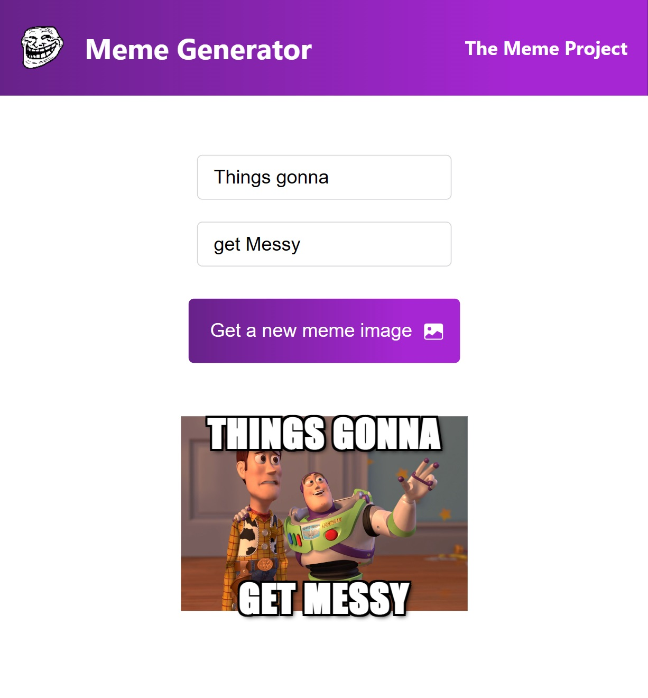

# Random meme generator

Generate the random memes and caption them as you want.

## Description

The project is made while following steps in course :  [https://scrimba.com/learn/learnreact](Scrimba)

The application produces a random image fetched from a API and applies the tag lines given by user at the top and bottom.

We can see this from following sample image:



The text added in the top and bottom inputs will be added on the top and bottom of image.

Each time we click on the "Get a new meme image" we will get a new image. Even though the image is changed it is made so that the text will remain as it is(Thanks to ```React.useState()```)

We can rather use this to play a game in which we can have two different captions and check if there is any image which can match those captions.

## Technicals

We use different types of react hooks such as useState, useEffect etc. to fetch the data from the API and then main it in a state in application.

We are fetching the data that application requires to create a meme (Basically a meme image) using the API [https://api.imgflip.com/get_memes](imgflip)
